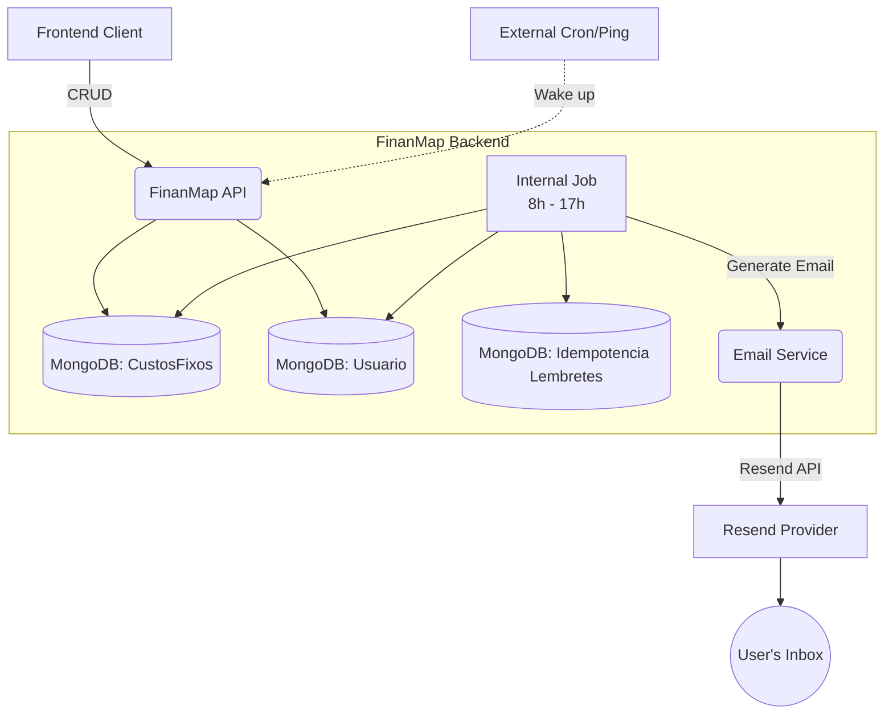

# Technical Design — Custos Fixos

| Field        | Value                        |
| ------------ | ---------------------------- |
| Tech Lead    | @Usuario                     |
| Team         | Time Backend                 |
| Epic/Ticket  | Custos Fixos                 |
| Status       | Draft                        |
| Created      | 2026-05-21                   |
| Last Updated | 2026-05-21                   |

## Context

Atualmente, o FinanMap controla despesas, receitas e investimentos, mas os usuários não possuem um local nativo para acompanhar compromissos financeiros recorrentes atrelados a dias de vencimento (como contas de luz, internet, etc.). Eles acabam dependendo da própria memória ou de soluções externas para não esquecer esses pagamentos mensais.

A solução de "Custos Fixos" introduz o cadastro de compromissos recorrentes focados exclusivamente em **lembretes**. A aplicação enviará e-mails de alerta consolidados 3 dias antes do vencimento e no próprio dia do vencimento, permitindo que o usuário acompanhe suas contas sem precisar vinculá-las imediatamente como "Despesa" na contabilidade.

## Problem Statement & Motivation

### Problems We're Solving

- **Falta de acompanhamento de vencimentos**: Os usuários esquecem datas de vencimento de contas fixas por não terem onde centralizá-las no FinanMap antes do lançamento final. — Impacto: Pagamento com atraso, multas, e necessidade de usar apps paralelos de anotação.

### Why Now?

- O acompanhamento de despesas é essencial para o controle financeiro, e esquecer de pagar contas básicas quebra a confiança do usuário no próprio controle financeiro que o app busca centralizar.

### Cost of Inaction

- **Business**: Perda de engajamento do usuário, que passa a depender de outros apps de checklist financeiro.
- **Users**: Insegurança em relação aos pagamentos do mês e possível prejuízo financeiro com juros de mora e multas.

## Scope

### In Scope (V1)

- CRUD de Custos Fixos (Nome, Dia do Vencimento, Categoria opcional).
- Ativação/Inativação individual de cada custo.
- Opt-out global: Configuração para usuário desativar todos os lembretes de uma só vez.
- Job agendado interno (rodando de hora em hora entre 8h e 17h) para disparar os lembretes por e-mail.
- E-mails de lembrete consolidados (3 dias antes e no dia do vencimento), sem valores financeiros.
- Tratamento de idempotência no disparo dos e-mails.

### Out of Scope (V1)

- Conversão automática do Custo Fixo em uma Despesa efetiva na competência do mês.
- Notificações via Push ou SMS.
- Lançamento de valores monetários (Custos Fixos da V1 não possuem R$).
- Relatório de histórico de lembretes na interface.

### Future Considerations (V2+)

- Geração automática de Despesa a partir do alerta do Custo Fixo.
- Diferentes canais de notificação (Push Mobile).

## Technical Solution

### Architecture Overview

O sistema utilizará a infraestrutura existente (MongoDB e provedor Resend) com a adição de um Job Interno de agendamento que processará os e-mails. Como a aplicação sofre de "cold start", um serviço de Ping Externo "acordará" a aplicação nas primeiras horas do dia. O Job Interno rodará em intervalos definidos (ex. a cada hora, das 8h às 17h) para garantir que os lembretes do dia sejam disparados, independentemente de eventuais atrasos. O controle de não-duplicação (idempotência) ocorrerá por meio de uma coleção de histórico.

**Key Components**:

- **CustoFixo API**: Módulo de CRUD para que o frontend gerencie os custos fixos e os status (ativos/inativos).
- **Processador de Lembretes (Job Interno)**: Job que roda em background verificando custos fixos que vencem hoje ou daqui a 3 dias.
- **Repositório de Idempotência**: Coleção no Mongo com chave única composta e índice TTL de 2 meses para registrar se um e-mail já foi enviado.
- **EmailService (Existente)**: Wrapper de envio através do Resend, formatando o template HTML consolidado.

**Architecture Diagram**:

### Data Flow

1. **Cadastro**: O usuário cadastra um Custo Fixo com vencimento em determinado dia (1..31).
2. **Execução do Job**: A cada hora (8h - 17h), o *Processador de Lembretes* verifica execuções.
3. **Cálculo de Datas**: Ele calcula as datas alvo: "Hoje" e "Hoje + 3 dias".
4. **Agrupamento**: Para cada alvo, busca e agrupa todos os custos fixos ativos de todos os usuários aplicáveis.
5. **Verificação de Envio**: Para cada usuário, consulta o *Repositório de Idempotência* pela chave `[UsuarioId_DataReferencia_TipoLembrete]`.
6. **Disparo**: Se não existe registro e o Opt-out global não está ativo, envia o e-mail unificado.
7. **Registro**: Insere com sucesso a chave no *Repositório de Idempotência* para impedir novas tentativas.

### APIs & Endpoints

| Endpoint | Method | Description | Request | Response |
|----------|--------|-------------|---------|----------|
| `/api/custos-fixos` | POST | Cria custo fixo | `{ nome, diaVencimento, categoriaId? }` | `201 Created` |
| `/api/custos-fixos` | GET | Lista custos fixos | - | `200 [ {id, nome, diaVencimento, ativo} ]` |
| `/api/custos-fixos/{id}` | PUT | Atualiza custo fixo | `{ nome, diaVencimento, ativo, categoriaId? }` | `200 OK` |
| `/api/custos-fixos/{id}` | DELETE | Exclui custo fixo | - | `204 No Content` |
| `/api/usuarios/configuracoes/custos-fixos` | PUT | Atualiza Opt-Out | `{ receberNotificacoes: boolean }` | `200 OK` |

*(A rota de Opt-Out pode ser ajustada e inserida na Controller atual de Usuários).*

### Database Changes

**New Tables / Collections**:
- `CustosFixos`:
  - `UsuarioId` (ObjectId, indexado)
  - `Nome` (String)
  - `DiaVencimento` (Int, 1-31)
  - `CategoriaId` (ObjectId, opcional)
  - `Ativo` (Boolean)
  - Índice Único Composto: `{ UsuarioId: 1, Nome: 1, DiaVencimento: 1 }`

- `CustosFixosLembretesHistorico` (Idempotência):
  - `UsuarioId` (ObjectId)
  - `DataReferencia` (DateTime)
  - `TipoLembrete` (Enum: `DiaDoVencimento`, `Antecedencia`)
  - `CreatedAt` (DateTime)
  - Índice Único Composto: `{ UsuarioId: 1, DataReferencia: 1, TipoLembrete: 1 }`
  - Índice TTL: `{ CreatedAt: 1 }` (Expire após 60 dias)

**Schema Modifications**:
- `Usuario` (ou configurações atreladas):
  - Adição do campo `ReceberNotificacoesCustosFixos` (Boolean, default: `true`).

## Key Decisions & Trade-offs

| Decision | Choice Made | Alternatives Rejected | Rationale |
|----------|-------------|-----------------------|-----------|
| **Estratégia de Job** | Job Interno (8h-17h, hora em hora) acordado por ping externo | Job puramente externo batendo em endpoint de processamento | Remove a necessidade de autenticação complexa S2S e resolve o cold-start com resiliência pelas múltiplas tentativas ao longo do dia. |
| **Idempotência de Envio** | Collection dedicada com TTL Index de 2 meses | Campo "UltimoEnvio" no Custo Fixo; Manter histórico permanente | O histórico permanente não é requisito de negócio e ocuparia espaço sem necessidade. O TTL limpa dados que só servem para barrar duplicidade no mês da competência. |
| **Agrupamento de E-mails** | Um e-mail por data-alvo consolidado | Um e-mail para cada Custo Fixo do usuário | Evita causar spam caso o usuário tenha vários vencimentos no mesmo dia, proporcionando melhor experiência. |

## Risks

| Risk | Impact | Probability | Mitigation |
|------|--------|-------------|------------|
| **Duplicação de Envio** (Spam) | Alto | Baixa | A coleção de histórico com índice único garante a idempotência em nível de banco de dados, falhando se o job tentar processar a mesma chave. |
| **Pausas prolongadas da API (Cold Start)** | Médio | Alta | O serviço de Ping Externo vai acordar a API nas primeiras horas, e o intervalo de tentativas de hora em hora (8h às 17h) garante redundância na execução do dia. |
| **Dias Inexistentes no Mês** (Ex: 31/Fev) | Médio | Alta | A regra de negócio para a montagem de dados no Job será ajustada para voltar para o último dia válido do mês ao processar a data. |

## Security Considerations

- **Proteção de Rotas M2M**: Não é necessário expor endpoint para iniciar processamento, mitigando ataques. Apenas o Ping Externo que já não tem regra de negócio pode ser exposto caso não haja uso de um `/health` genérico.
- **Isolamento**: O backend validará a autorização do token JWT ao inserir Custos Fixos, garantindo vinculação apenas com o usuário dono.

## Monitoring & Observability

- **Logs Estruturados**: O job emitirá log `Information` a cada processamento e logs de `Warning` / `Error` em falhas, especialmente problemas no Resend.
- **Omissão de Dados**: Os e-mails e logs conterão apenas o Nome e Dias Faltantes. Não há risco de vazar valores financeiros.
