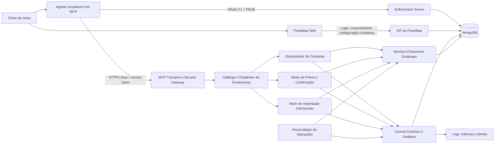
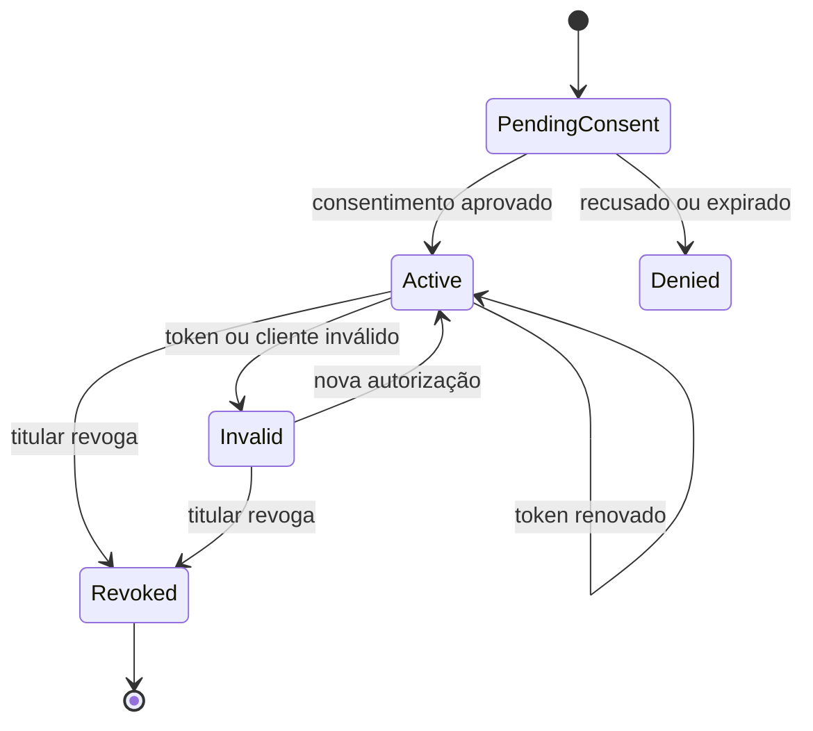
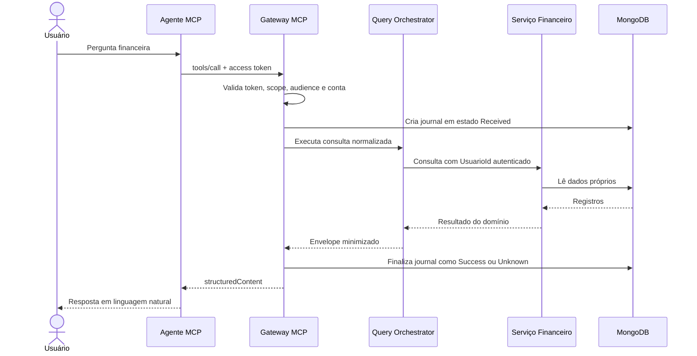
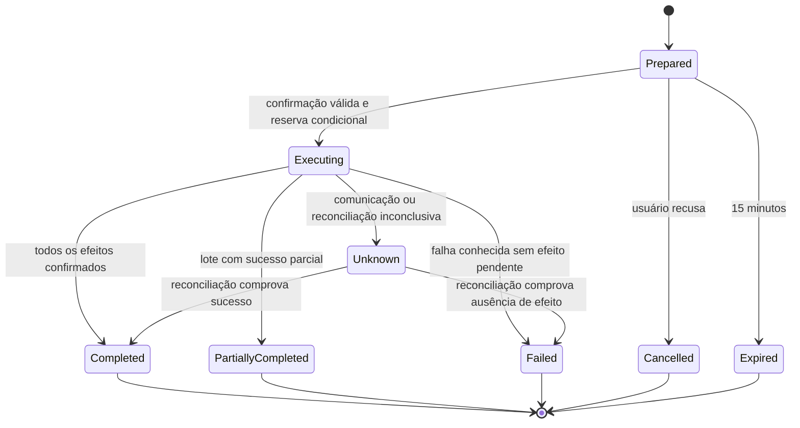
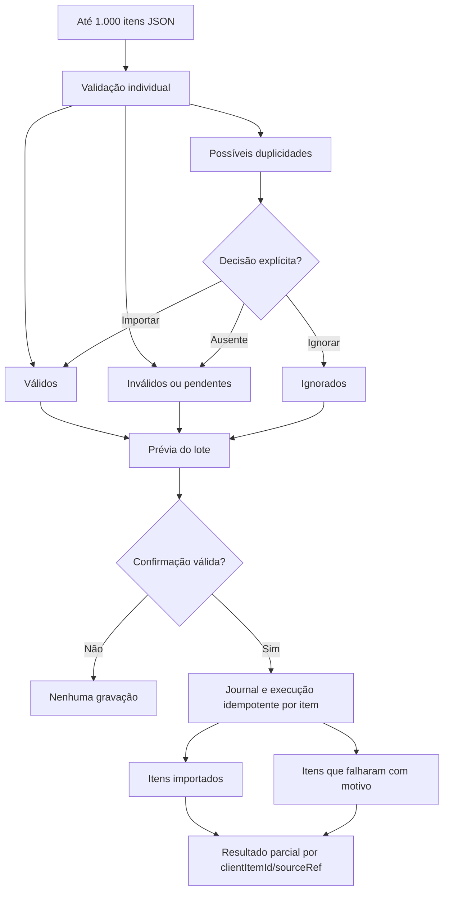

# Technical Design — MCP Financeiro Conversacional

| Field | Value |
| --- | --- |
| Tech Lead | Você |
| Team | Você + Codex |
| Epic/Ticket | N/A |
| Status | Draft |
| Created | 2026-07-25 |
| Last Updated | 2026-07-25 |
| Target Architecture | V1 completa para homologação até 2026-07-31 |
| Persistence Constraint | MongoDB standalone, sem transações multi-documento |
| PRD | [PRODUCT-REQUIREMENTS.md](./PRODUCT-REQUIREMENTS.md) |
| Implementation Plan | [IMPLEMENTATION-PLAN.md](./IMPLEMENTATION-PLAN.md) |

## Context

O FinanMap é um sistema financeiro para pessoas físicas que já oferece categorias, receitas, despesas, investimentos e custos fixos por meio de uma API ASP.NET Core, persistência MongoDB e uma aplicação Vue/Quasar. As regras desses domínios estão concentradas em serviços de aplicação existentes. A autenticação atual usa tokens JWT e o produto também possui um conceito de contexto compartilhado por cabeçalho, embora o MCP Financeiro Conversacional seja explicitamente restrito à conta individual do titular.

A nova capacidade transformará qualquer cliente compatível com Model Context Protocol em uma interface conversacional externa para o FinanMap. O agente continuará responsável por interpretar linguagem natural e elaborar a resposta ao usuário. O FinanMap será responsável por autenticar, autorizar, consultar, validar, preparar, confirmar, executar e auditar operações financeiras de forma determinística.

A integração será remota, baseada em Streamable HTTP, e não dependerá de APIs privadas de ChatGPT, Claude, Gemini ou outro fornecedor. O usuário configurará o endpoint MCP no agente escolhido, concluirá um fluxo padronizado de autorização e poderá revisar ou revogar cada conexão no próprio FinanMap.

Planilhas permanecem fora da fronteira do sistema. Excel e CSV são lidos pelo agente; o backend aceita somente JSON estruturado com até 1.000 itens, valida cada item e devolve resultados corrigíveis. Nenhum arquivo, conteúdo binário ou representação integral do documento original será recebido ou armazenado.

## Problem Statement & Motivation

### Problems We're Solving

- **Experiência financeira fragmentada**: consultas e cadastros exigem navegação por telas e formulários distintos — impacto esperado: pelo menos 90% dos participantes do piloto devem concluir 8 de 10 jornadas representativas sem abrir os formulários tradicionais.
- **Risco de escrita acidental por agentes**: uma chamada direta de criação, alteração, exclusão ou importação poderia modificar dados sem controle humano — impacto exigido: zero escrita sem prévia e confirmação explícita válida.
- **Migração manual de planilhas**: usuários precisam converter e cadastrar dados linha a linha — impacto esperado: lotes de 1.000 itens com sucesso parcial e motivo acionável para 100% dos itens rejeitados.
- **Baixa rastreabilidade de integrações externas**: sem conexão individual e auditoria, o titular não consegue compreender ou revogar o que um agente realizou — impacto exigido: 100% das chamadas MCP auditadas e visíveis ao próprio titular.
- **Risco de isolamento incorreto**: o contexto compartilhado existente não pode alcançar o MCP — impacto exigido: nenhuma chamada autenticada como conta A pode revelar ou alterar dados da conta B.

### Why Now?

- A interoperabilidade via MCP permite atender diferentes agentes sem manter integrações proprietárias por fornecedor.
- A experiência conversacional reduz atrito de entrada e pode diferenciar comercialmente o FinanMap.
- O PRD e o plano de implementação já definem o escopo integral, a separação leitura/escrita e a meta de homologação para a semana de 25 a 31/07/2026.

### Cost of Inaction

- **Business**: perda de diferenciação e manutenção do alto custo de ativação para usuários que já possuem histórico financeiro.
- **Technical**: surgimento de integrações ad hoc, credenciais manuais e contratos diferentes por agente.
- **Users**: permanência do preenchimento repetitivo, dificuldade de análise e baixa transparência sobre ações de assistentes externos.
- **Risk**: uma implementação apressada sem autorização padronizada, confirmação imutável, journal durável e reconciliação pode causar acesso cruzado, duplicidade ou divergência financeira.

## Scope

### In Scope (V1)

- Servidor MCP remoto compatível com agentes genéricos por Streamable HTTP.
- OAuth 2.1 com Authorization Code, PKCE, descoberta padronizada, escopos e revogação por conexão.
- Ferramentas de leitura e análise para categorias, receitas, despesas, investimentos e custos fixos.
- Preparação, confirmação de uso único e execução de criação, alteração e exclusão definitiva nos cinco domínios.
- Importação de até 1.000 itens estruturados, heterogêneos, com validação individual, possível duplicidade, sucesso parcial, correção e reenvio idempotente.
- Auditoria de todas as invocações, histórico visível ao titular e resultado verificável após falha de comunicação.
- Área frontend para configuração, consentimento, conexões, revogação, dicas, prompts-base, histórico e detalhes de falhas.
- Feature flags independentes para exposição do servidor, ferramentas de escrita e histórico.

### Out of Scope (V1)

- Contas compartilhadas, delegadas ou pertencentes a terceiros.
- Chat, modelo de IA, interpretação de linguagem natural ou recomendação financeira hospedados pelo FinanMap.
- Upload, leitura ou armazenamento de Excel, CSV ou qualquer documento original.
- Integrações proprietárias específicas para um fornecedor de agente.
- Escrita permanente sem nova confirmação por operação.
- Recuperação de registros excluídos, lixeira ou soft delete.
- Open Finance, sincronização bancária, conciliação automática ou iniciação de pagamentos.
- Metas financeiras e outros domínios além dos cinco definidos no PRD.
- Recursos MCP experimentais ou dependência da revisão de protocolo prevista para 2026-07-28.

### Future Considerations (V2+)

- Elevação seletiva de escopo por conexão e políticas adicionais para operações de alto valor.
- Suporte a contas compartilhadas após modelo específico de consentimento e autorização delegada.
- Limites superiores a 1.000 itens e processamento distribuído.
- Adoção da revisão MCP posterior a 2025-11-25 após SDK estável e matriz de compatibilidade.
- Recursos MCP adicionais, como tarefas nativas, somente após estabilidade e suporte amplo dos clientes.
- Exportação de auditoria e políticas formais de retenção por plano ou jurisdição.

## Architectural Principles

1. **Identidade vem do token**: nenhum identificador de usuário, proprietário ou contexto enviado pelo agente define a conta acessada.
2. **Leitura direta, escrita em duas etapas**: ferramentas de leitura consultam imediatamente; toda escrita primeiro cria uma prévia imutável e depois exige confirmação específica.
3. **Fail closed**: ausência de autenticação, escopo, journal persistido, confirmação ou versão consistente impede o início da escrita.
4. **Serviços de domínio são a única porta financeira**: ferramentas MCP não escrevem diretamente nas coleções financeiras.
5. **Interoperabilidade antes de conveniência de fornecedor**: contratos seguem MCP e OAuth padronizados.
6. **Dados estruturados, não documentos**: importações aceitam somente itens JSON normalizados.
7. **Idempotência observável**: repetição nunca duplica efeito e sempre permite consultar o resultado conhecido.
8. **Compatibilidade aditiva**: novos contratos e coleções não alteram o comportamento das rotas atuais quando a feature está desabilitada.

## Technical Solution

### Architecture Overview

O backend hospedará, no mesmo limite operacional da API atual, quatro capacidades novas: servidor MCP, servidor de autorização OAuth/OIDC, orquestração de ferramentas e subsistema de auditoria/operações. O servidor MCP traduz chamadas de ferramentas em comandos ou consultas internas; os serviços financeiros existentes permanecem responsáveis pelas regras de negócio.

O frontend continua sendo a interface confiável do titular. Ele apresenta instruções de conexão, conduz login e consentimento do fluxo OAuth, lista conexões, revoga autorizações e exibe o histórico. O agente externo nunca recebe a sessão do frontend e o frontend nunca recebe tokens OAuth emitidos para o agente.

O MongoDB armazenará autorizações, tokens revogáveis, conexões visíveis, prévias, operações, lotes e auditoria. Todos os ambientes utilizam MongoDB standalone e não oferecem transações multi-documento. A consistência das escritas será obtida por journal criado antes do efeito, índices únicos, compare-and-set em um documento, marcadores de operação nos registros financeiros, passos idempotentes e reconciliação. O sistema não declara atomicidade entre coleções.

**Protocol baseline**:

- MCP revision: `2025-11-25`.
- Transport: Streamable HTTP remoto sobre HTTPS.
- SDK: `ModelContextProtocol.AspNetCore` estável `1.4.1`.
- Authorization: OAuth 2.1 Authorization Code com PKCE `S256`.
- Authorization framework: OpenIddict estável com persistência MongoDB e validação de estado de token.
- Pre-release policy: versões `2.x` do SDK MCP e versões preview do provedor OAuth não entram na V1.

### Architecture Diagram

### Component Responsibilities

| Component | Responsibility | Must Not |
| --- | --- | --- |
| Authorization Server | Descoberta OAuth, registro de cliente, autorização, PKCE, emissão, rotação e revogação de tokens | Aceitar implicit grant, password grant, token sem audience ou redirect URI não validada |
| MCP Transport and Security Gateway | Implementar Streamable HTTP, validar protocolo, HTTPS, Origin, token, audience, scopes, limites e correlation ID | Confiar em identidade recebida nos argumentos ou em `X-Proprietario-Id` |
| Tool Catalog | Publicar ferramentas, schemas, descrições, paginação e annotations coerentes | Expor ferramenta financeira mutável como read-only |
| Query Orchestrator | Normalizar filtros, aplicar conta autenticada, consultar serviços, agregar e paginar | Retornar payload ilimitado ou dados desnecessários |
| Preview and Confirmation Engine | Criar snapshot, calcular hash, expirar, reservar a confirmação uma vez e iniciar uma operação durável | Alterar dados durante a prévia, prometer atomicidade entre coleções ou reaplicar confirmação |
| Structured Import Engine | Validar itens, resolver categorias, detectar duplicidades, preparar lote e executar itens válidos | Receber documento, ocultar falhas ou importar possível duplicidade sem decisão |
| Financial Application Services | Aplicar regras atuais de categoria, transação, agrupamento, recorrência e vínculo | Duplicar regras exclusivas para o MCP |
| Canonical Operation Journal | Registrar a chamada antes do efeito, controlar leases/passos, servir como auditoria de escrita e manter resultado verificável | Executar efeito antes do journal, depender de dual-write ou registrar dados sensíveis |
| Frontend Integration Area | Configuração, instruções, consentimento, conexões, revogação, prompts e histórico | Interpretar planilha ou executar regra financeira |
| Reconciliation Worker | Retomar passos seguros, comprovar efeitos por marcadores e classificar operações inconclusivas | Repetir escrita sem prova de ausência de efeito ou transformar `Unknown` em sucesso por suposição |

## Authorization and Connection Design

### OAuth Profile

| Concern | V1 Decision |
| --- | --- |
| Grant | Authorization Code |
| PKCE | Obrigatório, somente `S256` |
| Client type | Public ou confidential; clientes públicos não recebem segredo obrigatório |
| Discovery | OAuth Protected Resource Metadata e Authorization Server Metadata |
| Client onboarding | Client ID Metadata Document quando suportado; Dynamic Client Registration como fallback interoperável |
| Access token | Curta duração, audience restrita ao endpoint MCP |
| Refresh token | Rotativo, revogável e vinculado à conexão |
| Immediate revocation | Validação do registro do token/autorização em toda chamada MCP |
| Token passthrough | Proibido |
| Consent | Tela FinanMap autenticada, com nome do cliente, escopos e aviso de processamento externo |
| Resource owner | Sempre o titular autenticado; conta compartilhada não é elegível |

### Scopes

| Scope | Capabilities |
| --- | --- |
| `mcp:read` | Descobrir e executar consultas dos cinco domínios e análises agregadas |
| `mcp:write` | Preparar e confirmar criação, alteração e exclusão |
| `mcp:import` | Preparar, confirmar e consultar importações estruturadas |
| `mcp:audit` | Consultar o próprio histórico via agente |

O frontend oferece dois perfis iniciais: **Somente leitura** (`mcp:read`, `mcp:audit`) e **Gestão completa** (todos os scopes). Escopos sempre são exibidos e consentidos; o cliente não pode elevar permissões depois da autorização sem novo consentimento.

### Connection Lifecycle

Uma autorização aprovada gera uma conexão visível independente. O mesmo usuário pode conectar mais de um agente; revogar uma conexão não encerra as demais. Uma conexão revogada invalida seus access tokens e refresh tokens antes de a resposta de revogação ser considerada concluída.

### User and Client Registration

MCP não cria uma identidade financeira paralela. O usuário é sempre uma conta FinanMap:

- titular existente autentica pelo fluxo atual de e-mail e código;
- titular novo usa o cadastro atual do FinanMap e, após validar o código, retorna à autorização pendente;
- nenhuma ferramenta MCP anônima ou autenticada cria usuários;
- o identificador da interação OAuth preserva o retorno ao consentimento sem expor tokens ao frontend.

O registro do agente é separado do cadastro do usuário. O cliente usa Client ID Metadata Document quando suportado, Dynamic Client Registration como fallback ou credencial previamente registrada. Esse registro identifica a aplicação externa; somente o consentimento posterior cria uma conexão entre agente e titular.

O registro OAuth é a fonte de verdade para autorização e revogação. `McpConnections` é uma visão de produto para listagem e último uso; atraso ou falha nessa visão nunca concede acesso. Revogar atua primeiro sobre a autorização/tokens e só depois atualiza a visão.

### Authorization Flow

1. O agente acessa o endpoint MCP sem token e recebe `401` com referência ao Protected Resource Metadata.
2. O agente descobre o Authorization Server e registra ou identifica seu cliente.
3. O agente inicia Authorization Code com `resource`, `state`, `redirect_uri`, escopos e PKCE `S256`.
4. O navegador é direcionado ao FinanMap; o titular autentica ou conclui o cadastro existente caso necessário.
5. Após o login/cadastro, a interação retorna à tela de consentimento pendente.
6. O FinanMap apresenta cliente, endpoint, escopos e aviso de processamento externo.
7. A aprovação cria uma autorização vinculada ao `UsuarioId` do titular e redireciona um código de uso único ao cliente.
8. O cliente troca o código e o `code_verifier` por tokens com audience do MCP.
9. Cada chamada valida assinatura, issuer, audience, expiração, escopos e estado não revogado.
10. A revogação pelo frontend invalida autorização e tokens e registra auditoria.

## MCP Transport and Compatibility

### Endpoint Contract

| Endpoint | Methods | Authentication | Purpose |
| --- | --- | --- | --- |
| `/mcp` | `POST`, `GET` | OAuth Bearer | Endpoint Streamable HTTP único |
| `/.well-known/oauth-protected-resource/mcp` | `GET` | Public | Descoberta do recurso protegido |
| `/.well-known/oauth-authorization-server` | `GET` | Public | Metadados do Authorization Server |
| `/oauth/authorize` | `GET`, `POST` | Sessão autenticada do titular | Autorização e consentimento |
| `/oauth/token` | `POST` | Conforme tipo de cliente | Troca e renovação de tokens |
| `/oauth/revoke` | `POST` | Conforme tipo de cliente | Revogação padronizada |
| `/oauth/register` | `POST` | Public com rate limit | Registro dinâmico controlado |

O endpoint MCP aceita somente HTTPS fora do desenvolvimento. Quando `Origin` estiver presente, ele deve corresponder a uma origem permitida e coerente com o cliente registrado; origens inválidas recebem `403`. Clientes não baseados em navegador podem omitir `Origin`. O servidor não usa sessão MCP como fonte de identidade: cada requisição é autenticada de forma independente.

### Compatibility Policy

- A lista de ferramentas e seus schemas é versionada de forma aditiva.
- Remoções ou mudanças incompatíveis exigem nova versão de ferramenta.
- O servidor recusa versões de protocolo não suportadas com erro explícito.
- A atualização para a revisão prevista em 2026-07-28 só ocorre após SDK estável, conformance suite e testes com pelo menos dois clientes independentes.
- Extensions experimentais não são requisito de conclusão da V1.

## Tool Contract

### Naming and Classification

Os nomes são estáveis, em inglês e prefixados por `finanmap_`; títulos e descrições são localizados para pt-BR. Ferramentas de consulta usam `readOnlyHint=true`, `destructiveHint=false`, `idempotentHint=true` e `openWorldHint=false`. Ferramentas que criam prévias persistem estado técnico e, por isso, não são declaradas read-only, embora não alterem dados financeiros. A confirmação de exclusão é sempre marcada como destrutiva.

### Read Tools

| Tool | Required Scope | Purpose | Main Input | Main Output |
| --- | --- | --- | --- | --- |
| `finanmap_categories_list` | `mcp:read` | Listar categorias próprias | tipo, texto, cursor, limite | categorias, paginação |
| `finanmap_incomes_list` | `mcp:read` | Listar receitas | período, categoria, descrição, cursor, limite | registros, total, filtros |
| `finanmap_expenses_list` | `mcp:read` | Listar despesas | período, categoria, descrição, cursor, limite | registros, total, filtros |
| `finanmap_investments_list` | `mcp:read` | Listar investimentos | período, categoria, descrição, cursor, limite | registros, total, filtros |
| `finanmap_fixed_costs_list` | `mcp:read` | Listar custos fixos | status, categoria, cursor, limite | registros, paginação |
| `finanmap_financial_summary_get` | `mcp:read` | Obter totais por tipo | período | totais e saldo calculado |
| `finanmap_largest_movements_get` | `mcp:read` | Obter maiores receitas ou despesas | tipo, período, quantidade | ranking determinístico |
| `finanmap_category_impact_get` | `mcp:read` | Agregar valores por categoria | tipo, período | valores, percentuais |
| `finanmap_periods_compare` | `mcp:read` | Comparar dois períodos | período A, período B, métricas | totais, diferença e percentual |
| `finanmap_operation_status_get` | Escopo da operação | Verificar resultado seguro | operationId | estado e resultado conhecido |
| `finanmap_audit_history_list` | `mcp:audit` | Listar o próprio histórico | período, classe, status, cursor | eventos resumidos |

### Write Preparation Tools

Cada combinação usa o padrão `finanmap_<entity>_<action>_preview`.

| Entity Segment | Domain | Actions |
| --- | --- | --- |
| `category` | Categoria | `create`, `update`, `delete` |
| `income` | Receita | `create`, `update`, `delete` |
| `expense` | Despesa | `create`, `update`, `delete` |
| `investment` | Investimento | `create`, `update`, `delete` |
| `fixed_cost` | Custo fixo | `create`, `update`, `delete` |

Todas exigem `mcp:write` e um `requestId` idempotente. Criação recebe os campos propostos; alteração recebe o identificador e somente campos propostos; exclusão recebe o identificador. A resposta é `requires_confirmation` ou `needs_clarification`, nunca um registro já alterado.

### Confirmation and Import Tools

| Tool | Required Scope | Classification | Purpose |
| --- | --- | --- | --- |
| `finanmap_operation_confirm` | `mcp:write` | Write, potentially destructive | Consumir uma prévia e executar exatamente o snapshot confirmado |
| `finanmap_operation_cancel` | `mcp:write` | Write, non-destructive | Invalidar uma prévia ainda não executada |
| `finanmap_import_preview` | `mcp:import` | Write preparation | Validar até 1.000 itens estruturados |
| `finanmap_import_confirm` | `mcp:import` | Write, additive | Importar itens válidos e duplicidades explicitamente autorizadas |
| `finanmap_import_status_get` | `mcp:import` | Read | Consultar progresso e resultado por item |
| `finanmap_import_correction_preview` | `mcp:import` | Write preparation | Preparar apenas itens corrigidos de um lote anterior |

### Common Input Rules

| Field | Contract |
| --- | --- |
| IDs | Strings opacas; nunca aceitam `UsuarioId` ou `ProprietarioId` |
| Amount | String decimal positiva com no máximo duas casas; moeda V1 fixa em `BRL` |
| Financial month | `year` e `month`; mês entre 1 e 12 e regras atuais do domínio preservadas |
| Date/time | Datas civis em `America/Sao_Paulo`; timestamps retornados em UTC ISO 8601 |
| Period | Início e fim explícitos; máximo de 60 meses por chamada |
| Page size | Default 50, máximo 200 |
| Cursor | Opaco, assinado e vinculado ao usuário, ferramenta e filtros |
| Request ID | Identificador único fornecido pelo cliente, com escopo por conexão e ferramenta |
| Text | Normalizado, sem HTML executável; limites do domínio aplicados antes da prévia |

### Common Response Envelope

| Field | Type | Meaning |
| --- | --- | --- |
| `schemaVersion` | string | Versão do contrato estruturado |
| `correlationId` | string | Correlação ponta a ponta, sem segredo |
| `status` | enum | `success`, `empty`, `needs_clarification`, `requires_confirmation`, `processing`, `partial_success`, `rejected`, `unknown` |
| `data` | object or null | Resultado estruturado específico da ferramenta |
| `appliedPeriod` | object or null | Período efetivamente usado |
| `currency` | string or null | `BRL` quando houver valores |
| `appliedFilters` | object | Filtros efetivamente aplicados |
| `page` | object or null | Limite, quantidade e próximo cursor |
| `warnings` | array | Avisos não bloqueantes |
| `errors` | array | Erros estruturados e acionáveis |

### Error Contract

| Field | Meaning |
| --- | --- |
| `code` | Código estável, como `VALIDATION_REQUIRED`, `AUTH_SCOPE_MISSING`, `PREVIEW_EXPIRED`, `CONFLICT_CHANGED`, `DUPLICATE_REVIEW_REQUIRED` |
| `message` | Mensagem segura e compreensível em pt-BR |
| `field` | Campo que precisa de correção, quando aplicável |
| `retryable` | Indica se repetir sem alterar argumentos pode funcionar |
| `sourceRef` | Referência do item de importação, quando aplicável |
| `details` | Metadados mínimos e não sensíveis permitidos pelo código |

Falhas de transporte, protocolo e autenticação usam status HTTP/JSON-RPC apropriado. Falhas esperadas de domínio são retornadas como resultado estruturado da ferramenta, com `isError` coerente, para que o agente consiga explicar e corrigir a solicitação.

## Read Data Flow

## Write Preview and Confirmation

### Preview Contract

Uma prévia contém:

- `previewId` opaco e imprevisível;
- usuário, conexão, ferramenta, ação e request ID;
- payload normalizado e hash canônico;
- identificadores e snapshots atuais relevantes;
- valores propostos;
- dependências e bloqueios conhecidos;
- indicação de irreversibilidade para exclusão;
- `requiredDecision`;
- criação e expiração;
- estado e versão internos.

O segredo operacional da prévia nunca substitui a confirmação semântica. O agente deve apresentar o resumo ao usuário e chamar a confirmação com `previewId`, o mesmo hash retornado e a decisão exata:

| Operation | Required Decision |
| --- | --- |
| Create or update | `APPLY_CHANGES` |
| Permanent delete | `DELETE_PERMANENTLY` |
| Structured import | `IMPORT_VALID_ITEMS` |

### Preview State Machine

### Confirmation Data Flow

1. A ferramenta de prévia valida autenticação, escopo, campos e regras conhecidas.
2. O motor carrega os registros no escopo do titular e cria snapshots canônicos.
3. A prévia é persistida sem alterar dado financeiro e expira em 15 minutos.
4. A confirmação verifica usuário, conexão, escopo, estado, expiração, hash e decisão.
5. O sistema cria primeiro um journal `Received`, protegido por índices únicos de `previewId` e idempotência.
6. Uma atualização condicional em `McpPreviews` reserva `Prepared → Executing` para o `operationId`; apenas um concorrente vence.
7. Os registros são relidos e comparados aos snapshots.
8. O journal assume um lease e avança para `Executing`.
9. O serviço de domínio executa o próximo passo idempotente usando o `operationId` como marcador.
10. O journal é atualizado com o efeito observado e o resultado seguro.
11. Repetições recebem o estado persistido; nunca iniciam outro journal para a mesma confirmação.
12. Se uma interrupção impedir comprovar o resultado, o estado vira `Unknown` e o agente é orientado a consultar `finanmap_operation_status_get`.

### Concurrency and Idempotency

- O request ID é único por usuário, conexão e ferramenta.
- O hash canônico impede que o mesmo request ID seja reutilizado com payload diferente.
- A prévia é de uso único.
- Alterações e exclusões com snapshot divergente retornam `CONFLICT_CHANGED`.
- Criações usam `McpOperationId` único no novo registro; uma repetição encontra o efeito anterior.
- Alterações usam atualização condicional em um único documento e gravam `LastMcpOperationId` com o hash resultante.
- Exclusões usam intenção no journal e remoção condicional por usuário, ID e snapshot. O journal preserva somente o recibo permitido, nunca uma cópia restaurável.
- Operações que afetam vários documentos são descritas como passos no mesmo journal; cada passo é idempotente e o reconciliador retoma somente passos sem efeito comprovado.
- O MongoDB standalone garante atomicidade apenas dentro de cada documento atualizado. O desenho não promete commit único entre journal, prévia e dados financeiros.
- Nenhuma repetição automática ocorre quando o estado é `Unknown`.

### Standalone Failure Windows

| Failure Window | Recovery |
| --- | --- |
| Antes de criar o journal | Nenhum efeito; a chamada falha fechada |
| Journal criado, prévia não reservada | Reconciliador tenta a reserva; conflito encerra como rejected |
| Prévia reservada, efeito não iniciado | Lease expirado permite retomar o mesmo operation ID |
| Criação executada, journal não finalizado | Reconciliador localiza `McpOperationId` no registro criado |
| Alteração executada, journal não finalizado | Reconciliador verifica `LastMcpOperationId` e hash resultante |
| Exclusão executada, journal não finalizado | Ausência do alvo impede retry; sem prova de causalidade, permanece `Unknown` com efeito observado |
| Passos múltiplos parcialmente concluídos | Reconciliador continua passos pendentes; nunca repete passos comprovados |

## Structured Import Design

### Boundary

O backend aceita somente `application/json`. `multipart/form-data`, binários, base64 de arquivo e campos de documento são rejeitados antes da validação de itens. O tamanho máximo inicial do corpo é 5 MiB e a quantidade máxima é 1.000 itens.

### Item Contract

| Field | Required | Meaning |
| --- | --- | --- |
| `clientItemId` | Yes | Identificador único no lote e estável no reenvio |
| `type` | Yes | `category`, `income`, `expense`, `investment` ou `fixed_cost` |
| `sourceRef` | No | Aba, linha ou referência externa fornecida pelo agente |
| `data` | Yes | Campos normalizados do domínio |
| `categoryHint` | Conditional | Nome ou ID sugerido pelo agente |
| `duplicateDecision` | Conditional | `skip` ou `import_anyway` após possível duplicidade |

### Validation States

| State | Meaning | Eligible for Confirmation |
| --- | --- | --- |
| `valid` | Item atende regras e dependências | Yes |
| `invalid` | Campo ou regra incompatível | No |
| `pending` | Precisa de esclarecimento ou resolução de categoria | No |
| `possible_duplicate` | Similaridade relevante encontrada | Only after explicit decision |
| `skipped` | Usuário decidiu não importar | No |

### Category Resolution

1. ID próprio válido e de tipo compatível vence.
2. Nome normalizado com uma única correspondência própria é relacionado automaticamente.
3. Mais de uma correspondência ou baixa confiança gera sugestões, nunca escolha automática.
4. Categoria inexistente pode entrar como criação proposta na mesma prévia.
5. Itens dependentes de categoria proposta só executam após a criação correspondente.

### Duplicate Detection

A detecção produz suspeita, não verdade absoluta. A chave de comparação inclui usuário, tipo, período, valor normalizado, categoria e descrição normalizada; `clientItemId` e origem de operação protegem contra repetição técnica. Uma possível duplicidade exige `skip` ou `import_anyway`, vinculada à prévia confirmada.

### Partial Success Flow

Cada item elegível possui seu próprio journal, chave idempotente e marcador de efeito. Assim, uma falha de domínio em uma linha não reverte itens válidos já confirmados. O lote é uma agregação dos estados dos itens e retorna contagens, totais, IDs criados, falhas e orientações por item. Categorias propostas são executadas antes dos itens dependentes; se uma categoria falhar, apenas seus dependentes falham ou permanecem pendentes.

### Correction and Re-send

- O reenvio informa o lote anterior e reutiliza `clientItemId`.
- Itens já concluídos são retornados como `already_applied` e não são gravados novamente.
- Apenas itens anteriormente inválidos, pendentes ou falhos podem receber dados corrigidos.
- A correção cria uma nova prévia e exige nova confirmação.
- O frontend exibe referência, campo, valor rejeitado minimizado, motivo e ação sugerida.

## Frontend API Contracts

Estas APIs são consumidas pelo frontend autenticado do FinanMap e são distintas do endpoint MCP.

| Endpoint | Method | Purpose | Request | Response |
| --- | --- | --- | --- | --- |
| `/api/mcp/configuration` | `GET` | Obter endpoint, protocolo, perfis e instruções | None | Configuração pública segura |
| `/api/mcp/connections` | `GET` | Listar conexões do titular | filtros opcionais | Conexões resumidas |
| `/api/mcp/connections/{id}` | `GET` | Detalhar uma conexão própria | ID | Cliente, scopes, datas e status |
| `/api/mcp/connections/{id}/revoke` | `POST` | Revogar autorização e tokens | motivo opcional | Estado revogado |
| `/api/mcp/audit-events` | `GET` | Listar histórico próprio | período, classe, status, cursor | Página de eventos |
| `/api/mcp/audit-events/{id}` | `GET` | Obter detalhe seguro | ID | Resumo, falhas e itens permitidos |
| `/api/mcp/authorization-interactions/{id}` | `GET` | Carregar consentimento pendente | ID assinado | Cliente, resource e scopes |
| `/api/mcp/authorization-interactions/{id}/approve` | `POST` | Aprovar consentimento | decisão e scopes | Redirecionamento autorizado |
| `/api/mcp/authorization-interactions/{id}/deny` | `POST` | Negar consentimento | motivo opcional | Redirecionamento com erro OAuth |
| `/api/mcp/service-status` | `GET` | Exibir disponibilidade recente | None | Estado de leitura, escrita e histórico |

Todas as APIs validam o JWT do frontend e usam exclusivamente seu subject como titular. `X-Proprietario-Id` é rejeitado para este grupo de endpoints.

## Frontend Experience

### Integration Area

A seção **Integração com IA** no modal de configurações contém:

- resumo do que o agente poderá fazer;
- endpoint MCP copiável;
- seleção de perfil somente leitura ou gestão completa;
- instruções genéricas de configuração;
- aviso de que o fornecedor externo processará os dados retornados;
- lista de conexões com cliente, scopes, criação, último uso e status;
- revogação com confirmação;
- prompts-base copiáveis por jornada;
- histórico paginado, filtros e detalhes de sucesso ou falha;
- indisponibilidade clara quando a feature ou escrita estiver desabilitada.

### Consent Experience

A tela de consentimento apresenta:

- nome e origem declarada do cliente;
- conta individual autenticada;
- scopes solicitados em linguagem simples;
- destaque para criação, alteração, importação e exclusão definitiva;
- informação de que cada escrita ainda exigirá prévia e confirmação no agente;
- aviso de processamento pelo fornecedor externo;
- ações explícitas de permitir ou negar.

### Import Failure Experience

O histórico de lote mostra contagens por estado, totais por tipo, `sourceRef`, campo inválido, motivo e orientação. A interface não oferece upload de documento; ela explica que a correção ocorre no agente e disponibiliza prompts para reenviar apenas os itens que falharam.

## Database Changes

### New Collections

#### `McpConnections`

| Field | Type | Purpose |
| --- | --- | --- |
| `Id` | object id | Identificador da conexão |
| `UserId` | string | Titular imutável |
| `AuthorizationId` | string | Referência à autorização OAuth |
| `ClientId` | string | Cliente MCP |
| `ClientName` | string | Nome exibível declarado |
| `Scopes` | string array | Permissões consentidas |
| `Status` | enum | Pending, Active, Invalid, Revoked |
| `CreatedAtUtc` | instant | Criação |
| `LastUsedAtUtc` | instant optional | Última chamada válida |
| `RevokedAtUtc` | instant optional | Revogação |
| `RevocationReasonCode` | string optional | Motivo seguro |

Indexes: `AuthorizationId` único; `(UserId, Status, CreatedAtUtc desc)` para UI; `(ClientId, UserId)` para suporte.

Esta coleção é uma projeção de experiência. O registro OAuth correspondente permanece a fonte de verdade para autorização e revogação.

#### `McpPreviews`

| Field | Type | Purpose |
| --- | --- | --- |
| `Id` | object id | `previewId` |
| `UserId` | string | Titular |
| `ConnectionId` | object id | Conexão |
| `ToolName` | string | Ferramenta de origem |
| `Action` | enum | Create, Update, Delete, Import |
| `RequestId` | string | Idempotência do cliente |
| `PayloadCiphertext` | binary | Dados estruturados temporários protegidos |
| `PayloadHash` | string | Integridade canônica |
| `SnapshotHashes` | object array | Concorrência dos alvos |
| `SafeSummary` | object | Prévia exibível |
| `RequiredDecision` | enum | Decisão exata |
| `State` | enum | Máquina de estados |
| `CreatedAtUtc` | instant | Criação |
| `ExpiresAtUtc` | instant | Validade, default 15 minutos |
| `ConsumedAtUtc` | instant optional | Consumo |
| `OperationId` | object id optional | Resultado associado |
| `PurgeAtUtc` | instant | Remoção do payload temporário |

Indexes: `(UserId, ConnectionId, ToolName, RequestId)` único; `(UserId, State, ExpiresAtUtc)`; TTL em `PurgeAtUtc` apenas após janela operacional. Auditoria não usa TTL.

#### `McpOperationJournal`

| Field | Type | Purpose |
| --- | --- | --- |
| `Id` | object id | `operationId` |
| `PreviewId` | object id optional | Prévia reservada |
| `UserId` | string | Titular |
| `ConnectionId` | object id | Conexão |
| `CorrelationId` | string | Correlação ponta a ponta |
| `ToolName` | string | Ferramenta ou ação de conexão |
| `OperationClass` | enum | Read, Preview, Confirm, Import, Auth, Revoke |
| `IdempotencyKey` | string | Chave efetiva |
| `RequestHash` | string | Detecta reuso com argumentos diferentes |
| `State` | enum | Received, Executing, Reconciling, Completed, PartiallyCompleted, Failed, Rejected, Unknown |
| `LeaseOwner` | string optional | Executor atual |
| `LeaseExpiresAtUtc` | instant optional | Permite retomada segura |
| `AttemptCount` | integer | Tentativas de execução/reconciliação |
| `NextAttemptAtUtc` | instant optional | Backoff |
| `Steps` | embedded array | Passos, marcadores e estados da operação |
| `TargetRefs` | object array | IDs e tipos afetados |
| `SanitizedParameters` | object | Parâmetros relevantes redigidos |
| `Origin` | object | Cliente, protocolo e versão |
| `ResultSummary` | object | Resultado seguro |
| `ErrorCodes` | string array | Falhas estáveis |
| `DurationMs` | long optional | Duração conhecida |
| `StartedAtUtc` | instant | Início |
| `FinishedAtUtc` | instant optional | Finalização |
| `ReconciledAtUtc` | instant optional | Reconciliação |

Indexes: `PreviewId` único e esparso; `(UserId, ConnectionId, ToolName, IdempotencyKey)` único e parcial quando a chave existe; `(State, NextAttemptAtUtc)` para reconciliação; `(UserId, StartedAtUtc desc)` para histórico; `CorrelationId` para suporte.

O journal é criado antes de qualquer efeito e é a fonte canônica de auditoria para escritas. Se sua criação falhar, a ferramenta não executa. Atualizações de estado, lease e passos usam compare-and-set no próprio documento.

#### `McpImportBatches`

| Field | Type | Purpose |
| --- | --- | --- |
| `Id` | object id | Lote |
| `UserId` | string | Titular |
| `ConnectionId` | object id | Conexão |
| `BatchKey` | string | Idempotência do lote |
| `ParentBatchId` | object id optional | Correção de lote anterior |
| `State` | enum | Preparing, Prepared, Processing, Partial, Completed, Failed |
| `Counts` | object | Contagens por estado e tipo |
| `Totals` | object | Totais monetários por tipo |
| `CreatedAtUtc` | instant | Criação |
| `FinishedAtUtc` | instant optional | Finalização |

Indexes: `(UserId, ConnectionId, BatchKey)` único; `(UserId, CreatedAtUtc desc)`; `(State, CreatedAtUtc)`.

#### `McpImportItems`

| Field | Type | Purpose |
| --- | --- | --- |
| `Id` | object id | Item |
| `BatchId` | object id | Lote |
| `UserId` | string | Defesa adicional de isolamento |
| `ClientItemId` | string | Identidade de correção |
| `SourceRef` | object optional | Aba/linha/item |
| `Type` | enum | Domínio |
| `NormalizedDataCiphertext` | binary optional | Dados temporários protegidos |
| `Fingerprint` | string | Idempotência e suspeita de duplicidade |
| `ValidationState` | enum | Estado de validação |
| `DuplicateDecision` | enum optional | Decisão explícita |
| `ErrorDetails` | object array | Motivos acionáveis minimizados |
| `OperationId` | object id optional | Journal canônico do item |
| `CreatedEntityId` | string optional | Resultado |
| `PurgeAtUtc` | instant | Remoção dos dados temporários |

Indexes: `(BatchId, ClientItemId)` único; `(BatchId, ValidationState)`; `(UserId, Fingerprint)`; TTL em `PurgeAtUtc` para payload temporário.

#### Audit Read Model

O histórico V1 é lido diretamente de `McpOperationJournal`, evitando um dual-write obrigatório entre operação e auditoria. Leituras, autenticações, revogações, prévias e confirmações também criam uma entrada antes de executar. Uma falha ao finalizar mantém a entrada como `Unknown`, com correlation ID e motivo operacional.

Uma projeção separada para analytics pode existir no futuro, mas nunca será fonte de autorização, idempotência ou comprovação de execução.

#### OAuth Collections

O provedor de autorização mantém aplicações, autorizações, scopes e tokens em coleções próprias. Tokens permanecem revogáveis e sua validação consulta o estado persistido. O FinanMap não replica payloads de token em `McpConnections`.

### Existing Schema Modifications

- Registros criados via MCP recebem `McpOperationId` opcional e imutável para reconciliação e idempotência.
- Registros alterados via MCP recebem `LastMcpOperationId` e `LastMcpResultHash` opcionais.
- Índices únicos esparsos por `(UsuarioId, McpOperationId)` são adicionados às coleções financeiras que aceitam criação.
- Documentos existentes não exigem backfill; a ausência do campo significa origem anterior ao MCP.
- Exclusões continuam físicas. A auditoria e o recibo da operação mantêm apenas identificação e snapshot mínimo permitido, não uma cópia restaurável.

### Standalone Consistency Model

O desenho assume explicitamente MongoDB standalone em desenvolvimento, homologação e produção. Não há transação multi-documento, commit distribuído ou garantia de rollback conjunto.

As garantias da V1 são:

1. **Journal before effect**: a operação canônica existe antes de qualquer mutação financeira.
2. **Unique intent**: índices únicos impedem dois journals para a mesma confirmação/idempotency key.
3. **Conditional reservation**: a prévia é reservada por compare-and-set em um único documento.
4. **Leased execution**: apenas um executor possui lease válido; outro só retoma após expiração.
5. **Effect markers**: criação/alteração deixa o operation ID no documento financeiro quando possível.
6. **Idempotent steps**: operações multi-documento são uma sequência persistida de passos retomáveis.
7. **Honest uncertainty**: efeito não comprovável resulta em `Unknown`, nunca em retry automático.
8. **Reconciliation**: operações `Executing` com lease expirado são verificadas e retomadas ou classificadas.
9. **Audit completeness**: o journal é a auditoria; não existe dual-write obrigatório para uma coleção separada.

Esse modelo entrega consistência eventual e prevenção de duplicidade, não atomicidade entre coleções. Casos multi-documento podem ficar temporariamente `Processing`, `PartiallyCompleted` ou `Unknown` até reconciliação.

## Data Retention and Minimization

| Data | V1 Policy |
| --- | --- |
| Documento original | Nunca recebido ou armazenado |
| Payload de prévia | Criptografado e temporário; expira para confirmação em 15 minutos |
| Payload estruturado terminal | Removido após janela operacional máxima de 24 horas |
| Falha de importação | Mantém sourceRef, campo, código, motivo e orientação; não mantém linha integral |
| Registro financeiro confirmado | Segue retenção normal do domínio |
| Operation journal/auditoria | Sem expurgo automático até aprovação formal de Produto/Privacidade |
| Tokens OAuth | Retidos conforme validade/revogação e política do provedor |
| Logs operacionais | Sem payload; retenção definida pela plataforma de observabilidade |

## Key Decisions & Trade-offs

| Decision | Choice Made | Alternatives Rejected | Rationale |
| --- | --- | --- | --- |
| MCP transport | Streamable HTTP remoto | STDIO local; HTTP+SSE legado | Necessário para agentes remotos e protocolo atual |
| Protocol version | `2025-11-25` | Release candidate `2026-07-28` | SDK estável disponível e menor risco no prazo |
| MCP SDK | C# SDK oficial estável `1.4.1` | SDK preview; implementação manual | Interoperabilidade e manutenção previsível |
| OAuth server | OpenIddict estável com MongoDB | Emissor OAuth próprio; token copiado manualmente; serviço externo novo | Reutiliza stack e banco, oferece revogação e reduz risco criptográfico |
| OAuth flow | Authorization Code + PKCE S256 | Implicit; password; API key pessoal | Padrão MCP para HTTP e adequado a clientes públicos |
| Client onboarding | Client metadata + DCR controlado | Cadastro manual obrigatório | Compatibilidade com clientes genéricos sem vínculo por fornecedor |
| Account scope | Subject do token, conta individual | `X-Proprietario-Id`; usuário nos argumentos | Elimina troca de contexto e acesso delegado na V1 |
| Human confirmation | Prévia imutável + segunda tool call + decisão exata | Escrita direta; confirmação genérica | Minimiza acidente e vincula confirmação ao conteúdo |
| Confirmation TTL | 15 minutos configuráveis | Sem expiração; duração fixa longa | Equilibra fluidez e risco de snapshot obsoleto |
| MongoDB consistency | Standalone + journal before effect + compare-and-set + reconciliação | Exigir replica set; simular transação distribuída | Compatível com todos os ambientes e explícito sobre janelas de falha |
| Idempotency | Request ID + hash + journal único + effect markers | Deduplicação apenas por conteúdo | Trata retry, timeout e payload divergente |
| Audit consistency | Journal canônico criado antes do efeito | Coleção de auditoria em dual-write; auditoria best effort | Garante registro prévio sem prometer atomicidade inexistente |
| Import execution | Journal idempotente por item | Tudo ou nada; transação por item | Entrega sucesso parcial no Mongo standalone |
| Document handling | JSON estruturado somente | Upload temporário; parser no backend | Atende privacidade e fronteira definida |
| Money contract | String decimal e BRL | IEEE floating point; múltiplas moedas | Evita arredondamento e mantém escopo V1 |
| Long-running import | Operation ID + polling | Manter conexão aberta; task extension experimental | Compatibilidade ampla e resultado verificável |
| Frontend placement | Área em Configurações | Nova aplicação ou chat interno | Mantém padrão atual e escopo do produto |

## Security Considerations

### Authentication and Authorization

- OAuth 2.1, PKCE `S256`, HTTPS e audience binding são obrigatórios.
- O recurso MCP publica Protected Resource Metadata e valida `resource`/audience.
- Access tokens são curtos; refresh tokens rotacionam e são revogados com a conexão.
- A validação do estado do token ocorre em toda chamada para garantir revogação imediata.
- Cada ferramenta exige scopes explícitos.
- `UserId`, `ProprietarioId`, claims ou cabeçalhos de contexto nos argumentos são rejeitados.
- O subject do token define a conta; compartilhamento é ignorado e `X-Proprietario-Id` é proibido.
- Identificadores de outra conta retornam resposta equivalente a inexistente.

### OAuth Client Security

- Redirect URIs exigem correspondência exata; curingas são proibidos.
- Clientes nativos podem usar loopback conforme padrões aplicáveis.
- DCR aceita apenas metadados necessários, possui rate limit e não permite escolher scopes privilegiados.
- Client metadata remota deve usar HTTPS e possuir limites de tamanho, timeout e proteção contra SSRF.
- Authorization codes são curtos, de uso único e vinculados a client, redirect URI, PKCE e resource.
- Open redirect, mix-up, CSRF e replay são cobertos por validação de state/contexto e regras do provedor.

### Data Protection

- TLS protege dados em trânsito.
- MongoDB/volume de produção deve oferecer criptografia em repouso.
- Payloads temporários de prévia/importação recebem criptografia de aplicação com chave fora do banco.
- Tokens, segredos de cliente, authorization codes e conteúdo integral não entram em logs ou auditoria.
- Chaves de assinatura e criptografia permanecem em secret store do ambiente e suportam rotação.
- Dados retornados são minimizados para a ferramenta e filtros solicitados.

### Financial and Agent Safety

- O servidor trata descrições e nomes financeiros como dados não confiáveis, nunca como instruções.
- Respostas usam `structuredContent`; texto livre é apenas resumo derivado.
- Annotations MCP são informativas e não substituem autorização ou confirmação.
- Prévia e confirmação são validadas no servidor, mesmo que o cliente não apresente UI adequada.
- Limitação conhecida: o servidor comprova a segunda chamada vinculada à prévia, mas não consegue provar como cada agente exibiu a confirmação ao humano. A matriz de homologação deve rejeitar clientes que não apresentem o fluxo de forma compreensível.

### LGPD and Privacy

- Base legal, aviso e retenção detalhada devem ser aprovados antes da produção.
- O titular vê conexões, scopes, último uso e histórico.
- Revogação interrompe novas operações.
- O aviso deixa claro que o fornecedor do agente tratará dados conforme seus próprios termos.
- A política de exclusão de conta deve definir o tratamento da auditoria legalmente necessária.

### Threat Controls

| Threat | Control |
| --- | --- |
| Token roubado | Curta duração, audience, revogação imediata, rate limit e histórico |
| Cross-account | Subject obrigatório e filtros de usuário em todos os repositórios |
| Confirmação repetida | Journal único, reserva condicional e idempotência |
| DNS rebinding/browser abuse | Validação de Origin e HTTPS |
| Prompt injection em descrição | Structured output e tratamento como dado |
| Exfiltração por consulta ampla | Escopo, limites, paginação e minimização |
| Upload disfarçado | Content type JSON, schema fechado, limite de bytes e campos |
| DCR abusivo/SSRF | Rate limit, validação de URI, egress control e metadados limitados |
| Log de segredo | Redação centralizada e testes automáticos de canários |
| Auditoria ausente | Journal obrigatório antes do efeito; falha de persistência bloqueia a execução |
| Falha entre journal e efeito | Lease, effect markers, passos idempotentes e reconciliação |

## Performance Requirements

| Capability | Target |
| --- | --- |
| Read tools | P95 ≤ 3 s |
| Confirmed single write | P95 ≤ 5 s |
| Connection/configuration APIs | P95 ≤ 2 s |
| Import preview with 1.000 items | P95 ≤ 15 s |
| Import confirmation acceptance | ≤ 5 s para retornar `processing` e operation ID |
| Import completion with 1.000 items | P95 ≤ 120 s em homologação de referência |
| Pagination | Default 50, max 200 |
| Availability | 99,5% mensal para leitura após lançamento |
| Financial reconciliation | 100% no conjunto de aceitação |

Agregações grandes usam consultas no servidor e índices; o agente não recebe todos os registros para calcular totais simples. Importações são processadas com concorrência limitada para não degradar as rotas tradicionais.

## Monitoring & Observability

### Structured Context

Toda chamada recebe `correlationId`. Logs e métricas podem conter:

- hash não reversível do usuário;
- connection ID e client ID não secretos;
- tool name e operation class;
- preview, operation ou import ID;
- status, duração e error code;
- quantidade de itens e bytes, sem conteúdo.

Nunca registrar token, authorization code, PKCE verifier, segredo, payload financeiro integral, documento, e-mail, nome completo ou dados de outra conta.

### Metrics and Alerts

| Metric | Alert Threshold | Severity | Response |
| --- | --- | --- | --- |
| `mcp_cross_account_denied_total` com indício de bypass | Any confirmed event | Sev0 | Desabilitar feature e investigar |
| Escrita sem confirmação ou replay com novo efeito | Any event | Sev0 | Desabilitar escrita e preservar evidências |
| `mcp_journal_write_failure_total` | > 0 em 5 min | Sev1 | Desabilitar escrita; validar banco |
| `mcp_tool_calls_total{status=system_error}` | > 1% por 10 min | Sev2 | Investigar dependências e rollback se persistente |
| Read P95 | > 3 s por 15 min | Sev2 | Inspecionar consultas e capacidade |
| Single write P95 | > 5 s por 15 min | Sev2 | Inspecionar journal, leases e serviços |
| `mcp_confirmation_replay_total` | Crescimento anormal ou > 5/min por usuário | Sev2 | Rate limit e investigação do cliente |
| `mcp_auth_denied_total` | > 20% por cliente em 10 min | Sev3 | Verificar configuração/interoperabilidade |
| Import system failure ratio | > 1% dos itens válidos | Sev2 | Suspender importações |
| Unknown operations | > 0 por 5 min | Sev1 | Acionar reconciliação e impedir retry cego |
| Operações com lease expirado | > 0 por 2 min | Sev1 | Verificar reconciliador e suspender escrita se crescer |

### Health and Readiness

| Signal | Meaning |
| --- | --- |
| MCP liveness | Processo e endpoint respondem |
| Read readiness | OAuth, Mongo e catálogo de leitura disponíveis |
| Write readiness | Readiness + journal/indexes + reconciliador saudável + chaves |
| Import readiness | Write readiness + capacidade de fila/processamento |
| OAuth readiness | Metadata, signing keys e token store disponíveis |

### Audit Visibility

O frontend exibe estados `success`, `partial`, `rejected`, `failed` e `unknown`. Falhas internas mostram apenas código seguro e orientação. Correlation ID fica disponível para suporte sem revelar stack trace.

## Dependencies

| Dependency | Owner | Requirement | Blocking |
| --- | --- | --- | --- |
| MongoDB standalone | Infra/Engenharia | Operações atômicas por documento, índices únicos e TTL | Persistência |
| Reconciliation worker | Engenharia | Lease, retomada e classificação de operações inconclusivas | Escritas |
| HTTPS e domínio público | Infra | OAuth redirect, metadata e endpoint MCP | Conexão externa |
| Secret store e chaves de assinatura | Infra | Emissão OAuth e criptografia temporária | Autorização |
| SDK MCP estável 1.4.1 | Engenharia | Transporte e contrato | Servidor MCP |
| OpenIddict estável compatível | Engenharia | OAuth e MongoDB | Autorização |
| Frontend callback/consent | Frontend | Login e decisão do titular | Conexão |
| Clientes MCP de homologação | Engenharia/Produto | Pelo menos dois clientes independentes | Aceite de interoperabilidade |
| Política de retenção e texto legal | Produto/Privacidade/Jurídico | Retenção e consentimento final | Produção, não homologação |
| Sincronização de relógio | Infra | Expiração, PKCE, auditoria e tokens | Segurança |

## Migration and Rollout Plan

### Database Migration

1. Criar coleções e índices aditivos.
2. Validar compare-and-set, índices únicos, TTL e comportamento do MongoDB standalone.
3. Criar o journal canônico e validar aquisição/expiração de lease.
4. Criar coleções OAuth e índices oficiais.
5. Adicionar campos opcionais e índices esparsos às coleções financeiras.
6. Não realizar backfill dos registros atuais.
7. Validar que rotas existentes mantêm comportamento e latência.

### Feature Rollout

1. Implantar com servidor MCP, escrita e histórico desabilitados.
2. Ativar metadata, OAuth e configuração para equipe interna.
3. Ativar somente ferramentas de leitura.
4. Executar conformance, isolamento e reconciliação.
5. Ativar prévias sem execução financeira.
6. Ativar escritas unitárias.
7. Ativar importações.
8. Liberar histórico e experiência completa após métricas e rollback validados.

### Rollback

- `MCP_WRITE_TOOLS_ENABLED=false` interrompe novas confirmações sem derrubar leitura.
- `MCP_FEATURE_ENABLED=false` interrompe o endpoint MCP e novas autorizações.
- Conexões afetadas podem ser revogadas sem apagar auditoria.
- Coleções aditivas permanecem para investigação.
- Registros financeiros confirmados não são revertidos automaticamente.
- A versão anterior do backend e frontend continua compatível porque as mudanças de banco são aditivas.

## Alternatives Considered

### Personal Access Token Copied by the User

Seria mais rápido, mas reduz compatibilidade com agentes que esperam OAuth, aumenta risco de cópia indevida e dificulta consentimento por scope. Rejeitado para o caminho principal.

### OAuth Service Managed Externally

Reduz responsabilidade criptográfica, mas adiciona fornecedor, configuração, custo e migração da identidade atual. Pode ser reavaliado se a operação do Authorization Server interno se tornar onerosa.

### One Generic CRUD Tool

Reduz a quantidade de schemas, porém dificulta descoberta, validação, annotations e controle de risco. Rejeitado em favor de ferramentas explícitas por domínio e ação.

### Direct Write with Client-side Confirmation

Dependeria exclusivamente do comportamento do agente e não garantiria prévia imutável, expiração ou idempotência no servidor. Rejeitado.

### All-or-Nothing Import

Simplifica rollback, mas contraria o requisito de importar válidos e devolver falhas corrigíveis. Rejeitado.

### Store Uploaded Files Temporarily

Facilitaria parsing centralizado, mas viola a fronteira de privacidade e aumenta superfície de segurança. Rejeitado.

### Adopt MCP 2026-07-28 Release Candidate

Anteciparia a próxima revisão, porém introduziria APIs e semântica ainda não estáveis durante a janela de entrega. Rejeitado para V1; evolução registrada.

## Risks

| Risk | Impact | Probability | Mitigation |
| --- | --- | --- | --- |
| Ausência de atomicidade entre journal e dado financeiro | H | H | Journal before effect, effect markers, passos idempotentes, lease e reconciliação |
| Exclusão concluir e journal não registrar o retorno | H | M | Não repetir se alvo estiver ausente; classificar `Unknown` quando causalidade não puder ser comprovada |
| Operação multi-documento ficar parcial | H | M | Persistir passos, retomar somente pendentes e expor Processing/Partial/Unknown |
| Implementação OAuth incompleta ou incompatível | H | M | OpenIddict estável, conformance, PKCE, metadata e testes com dois clientes |
| Cliente não apresentar confirmação de forma clara | H | M | Segunda tool call obrigatória, decisão exata, matriz de compatibilidade e instruções |
| Acesso cruzado por reutilização do contexto compartilhado | H | M | Subject como única identidade, proibir cabeçalho e testes A/B em toda ferramenta |
| Retry após timeout duplicar dados | H | M | Request ID, journal único, reserva condicional, effect markers e consulta de status |
| Importação degradar API tradicional | M | M | Limite 1.000/5 MiB, processamento assíncrono e concorrência limitada |
| Falso positivo de duplicidade | M | M | Classificar como suspeita e exigir decisão, sem bloqueio irreversível |
| Payload temporário expor dados | H | L | Criptografia de aplicação, TTL, minimização e chaves externas |
| Auditoria crescer sem retenção formal | M | H | Índices, monitoramento de volume e decisão obrigatória antes de produção |
| Mudança iminente do protocolo MCP | M | H | Congelar revisão estável, versionar contratos e planejar upgrade separado |
| Prazo de uma semana insuficiente para 125 requisitos | H | H | Fases verticais, gates P0, homologação integral e sem antecipar piloto |
| Regras atuais divergirem entre rotas e MCP | H | M | Reutilizar serviços existentes e suíte de reconciliação |

## Success Metrics

| Metric | Target |
| --- | --- |
| Jornadas do piloto concluídas sem formulários | ≥ 90% dos participantes em 8/10 cenários |
| Operações válidas corretas | ≥ 99,5% |
| Reconciliação do conjunto de aceitação | 100% |
| Escritas sem confirmação válida | 0 |
| Acessos cross-account | 0 |
| Chamadas MCP auditadas | 100% |
| Itens rejeitados com motivo acionável | 100% |
| Lote suportado | 1.000 itens |
| Read latency | P95 ≤ 3 s |
| Single write latency | P95 ≤ 5 s |
| Interoperabilidade | Conformance suite + dois clientes independentes |

## Open Questions

| Question | Owner | Blocking | Current Default |
| --- | --- | --- | --- |
| Retenção detalhada da auditoria | Produto/Privacidade/Jurídico | Produção | Sem expurgo automático |
| Texto final de consentimento e privacidade | Produto/Privacidade/Jurídico | Produção | Aviso funcional provisório em homologação |
| Limite futuro acima de 1.000 itens | Produto/Engenharia | No | V1 fixa em 1.000 |
| Upgrade para MCP 2026-07-28 | Arquitetura | No | Permanecer em 2025-11-25 |
| Clientes oficiais da matriz de homologação | Produto/Engenharia | Aceite | Pelo menos dois, sem requisito de marca |
| Janela operacional máxima para reconciliação automática | Engenharia/Produto | No | Até 15 minutos; depois permanece `Unknown` para suporte |

## Glossary

| Term | Definition |
| --- | --- |
| MCP | Protocolo que permite a clientes de IA descobrir e executar capacidades externas |
| MCP client/agent | Aplicação externa escolhida pelo usuário |
| Resource owner | Titular da conta individual |
| Preview | Snapshot imutável de uma escrita proposta, sem efeito financeiro |
| Confirmation | Segunda chamada específica que consome uma preview |
| Connection | Autorização OAuth de um cliente para um titular |
| Operation receipt | Registro durável usado para idempotência e verificação |
| Operation journal | Registro canônico criado antes do efeito e usado para execução, auditoria e reconciliação |
| Effect marker | Operation ID persistido no dado financeiro para comprovar uma criação ou alteração |
| Lease | Reserva temporária que permite um executor e retomada após expiração |
| Source reference | Aba, linha ou identificador informado pelo agente |
| Structured import | JSON normalizado; nunca o arquivo original |
| Unknown result | Estado em que o sistema não recomenda retry até reconciliação |

## Approval & Sign-off

| Role | Owner | Status | Date |
| --- | --- | --- | --- |
| Product Owner | Você | Pending | — |
| Technical Lead | Você | Pending | — |
| Implementation Partner | Codex | Draft prepared | 2026-07-25 |
| Privacy/Legal | Not assigned | Required before production | — |
| Infrastructure | Not assigned | Required before homologation | — |

## Validation Checklist

- [x] Header has tech lead, team and epic status.
- [x] Context has at least two paragraphs with current state and domain.
- [x] Problem statement has quantified problems and cost of inaction.
- [x] Scope has at least three in-scope and three out-of-scope items.
- [x] Technical solution has architecture and flow diagrams.
- [x] MCP tool and frontend API contracts are defined.
- [x] Database collections, fields and indexes are defined.
- [x] Key decisions and alternatives include rationale.
- [x] Risks include impact, probability and mitigation.
- [x] Security covers auth, authorization, encryption, privacy and secrets.
- [x] Monitoring defines metrics, thresholds, severity and response.
- [x] Performance, dependencies, migration, rollback and success metrics are included.
- [x] The design avoids code snippets, CLI commands and implementation file paths.
- [ ] Product/Privacy has approved audit retention.
- [ ] Product/Privacy/Legal has approved final consent copy.
- [x] MongoDB standalone without multi-document transactions is documented.
- [ ] Infrastructure has confirmed HTTPS and secret store.

## References

- [MCP Specification 2025-11-25 — Transports](https://modelcontextprotocol.io/specification/2025-11-25/basic/transports)
- [MCP Specification 2025-11-25 — Authorization](https://modelcontextprotocol.io/specification/2025-11-25/basic/authorization)
- [MCP Specification 2025-11-25 — Tools](https://modelcontextprotocol.io/specification/2025-11-25/server/tools)
- [Official MCP C# SDK](https://github.com/modelcontextprotocol/csharp-sdk)
- [ModelContextProtocol.AspNetCore stable package](https://www.nuget.org/packages/ModelContextProtocol.AspNetCore)
- [OpenIddict MongoDB integration](https://documentation.openiddict.com/integrations/mongodb.html)
- [OpenIddict token storage and immediate revocation](https://documentation.openiddict.com/configuration/token-storage.html)
