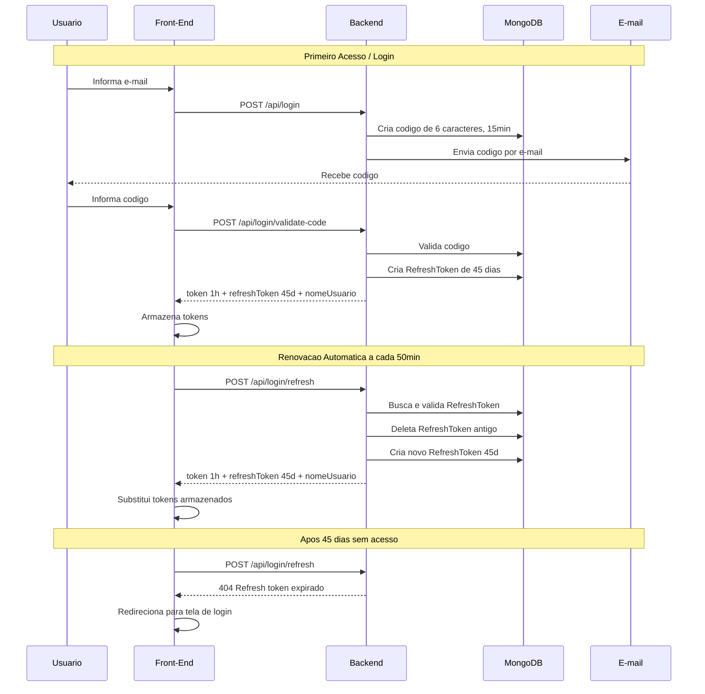

# Fluxo de Autenticação — FinanMap

## Visão Geral

O FinanMap utiliza autenticação **passwordless** (sem senha), baseada em código enviado por e-mail. Após validar o código, o backend emite dois tokens:

| Token | Tipo | Expiração | Onde armazenar |
|---|---|---|---|
| **Access Token** (JWT) | Bearer token para autenticar requisições | **1 hora** | Memory / LocalStorage |
| **Refresh Token** | Token opaco (GUID) para renovar a sessão | **45 dias** | LocalStorage / Cookie seguro |

---

## Endpoints

### 1. Solicitar Login — `POST /api/login`

Envia um código de verificação para o e-mail do usuário.

**Request:**
```json
{
  "email": "usuario@exemplo.com"
}
```

**Response (200):**
```json
// Sem corpo — indica que o e-mail foi enviado com sucesso
```

**Erros possíveis:**
- `404` — E-mail inválido ou usuário não cadastrado

---

### 2. Criar Conta — `POST /api/login/Create`

Cadastra um novo usuário e envia o código de verificação por e-mail.

**Request:**
```json
{
  "email": "usuario@exemplo.com",
  "nome": "João Silva"
}
```

**Response (200):**
```json
// Sem corpo — indica que o cadastro e envio do e-mail foram realizados
```

**Erros possíveis:**
- `400` — E-mail já cadastrado

---

### 3. Validar Código — `POST /api/login/validate-code`

Valida o código recebido por e-mail e retorna os tokens de autenticação.

**Request:**
```json
{
  "email": "usuario@exemplo.com",
  "codigo": "A1B2C3"
}
```

**Response (200):**
```json
{
  "token": "eyJhbGciOiJIUzI1NiIs...",
  "refreshToken": "a1b2c3d4e5f6789012345678901234567890abcd",
  "nomeUsuario": "João Silva"
}
```

**Erros possíveis:**
- `404` — Código inválido ou expirado (validade: 15 minutos)

---

### 4. Renovar Sessão — `POST /api/login/refresh`

Renova o access token usando um refresh token válido. **Não requer autenticação** (o JWT pode estar expirado).

**Request:**
```json
{
  "refreshToken": "a1b2c3d4e5f6789012345678901234567890abcd"
}
```

**Response (200):**
```json
{
  "token": "eyJhbGciOiJIUzI1NiIs...",
  "refreshToken": "novo_token_9876543210abcdef...",
  "nomeUsuario": "João Silva"
}
```

**Erros possíveis:**
- `404` — Refresh token inválido, já utilizado ou expirado

> **⚠️ Token Rotation:** O refresh token enviado é **invalidado imediatamente** e substituído por um novo na resposta. O front-end deve sempre armazenar o novo refresh token.

---

## Diagrama do Fluxo



---

## Segurança

| Mecanismo | Descrição |
|---|---|
| **JWT curto** | Access token com 1h reduz janela de exposição |
| **Refresh rotation** | A cada uso, o refresh token é trocado por um novo |
| **Uso único** | Refresh token usado é deletado imediatamente — protege contra replay |
| **45 dias máx** | Sessão expira completamente após 45 dias sem renovação |
| **HMAC-SHA256** | Tokens JWT assinados com chave simétrica |

---

## Estrutura no MongoDB

### Collection `RefreshToken`

```json
{
  "_id": "ObjectId",
  "Token": "guid-string-sem-hifens",
  "UsuarioId": "ObjectId referência ao usuario",
  "DataCriacao": "ISODate (UTC)",
  "DataExpiracao": "ISODate (UTC, +45 dias)"
}
```

**Índices:** `Token` (busca primária), `UsuarioId` (revogação por usuário)
